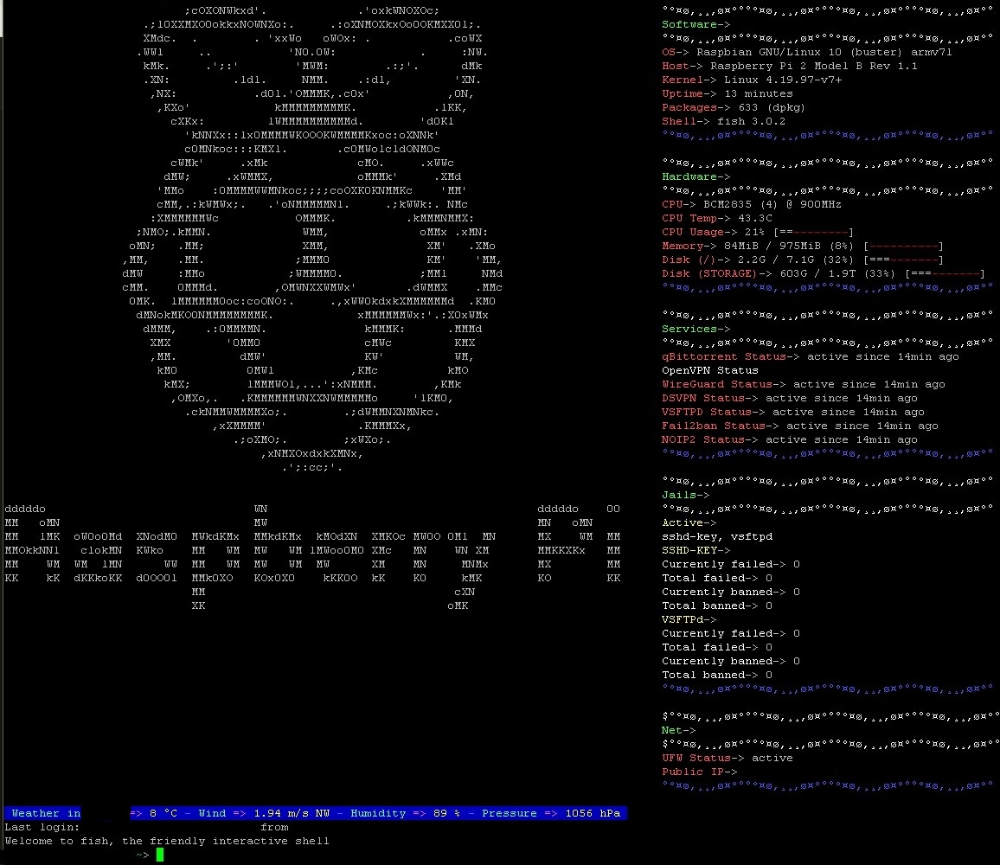

# pinas-motd-neofetch
An example Neofetch config for Raspbian based server

**Usage**

neofetch.config goes to `${HOME}/.config/neofetch/config.conf`, modify path to logo.txt in `"image_source="`.  

Create file in `/etc/update-motd.d/` (for example 10-neofetch) with
``` 
#!/bin/bash
su - username -c 'neofetch'
```
Then make it executable: `chmod +x`.  

Reboot and enjoy.  

For weather forecast install `ansiweather` with apt, then create file in `/etc/update-motd.d/` starting with higher number than neofetch one (for example 20-ansiweather) containing:
```
#!/bin/sh
ansiweather -l cityname
```


